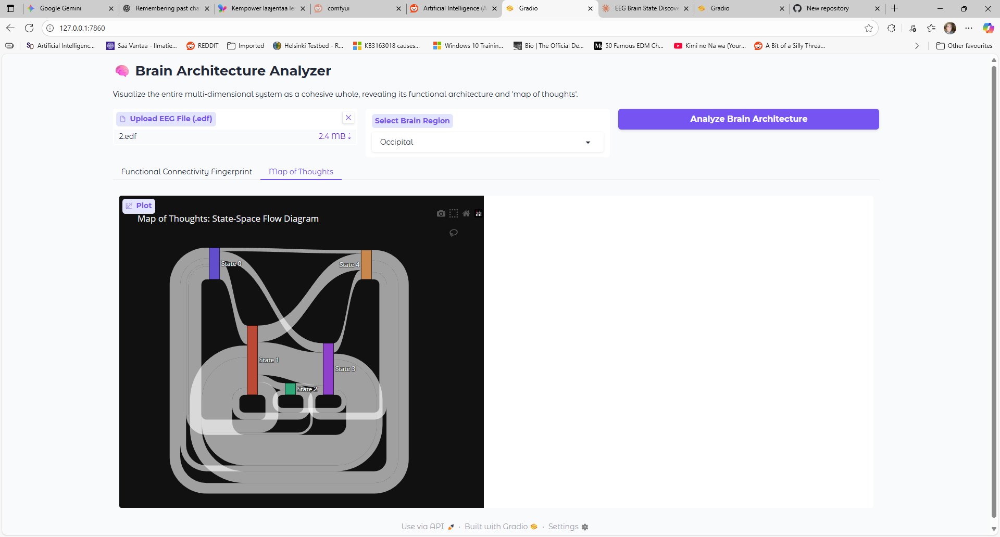

EDIT: Added new brain_set_system.py that can also analyze multiple users according to set theory. 
      something GPT 5 suggested. It also has Umap and tsne. 

# 🧠 Brain Architecture Analyzer

This tool visualizes the deep functional architecture of the human brain by analyzing raw EEG data. 
It moves beyond simple power spectrum analysis to reveal two key aspects of neural dynamics:

Functional Connectivity Fingerprint: A detailed heatmap showing the correlation between every frequency band
on every electrode, revealing the brain's underlying "wiring diagram."

Map of Thoughts: A state-space flow diagram that discovers the most common, stable brain states and maps the
probabilistic "highways" of thought between them.

Together, these visualizations provide a unique fingerprint of an individual's cognitive architecture.

# ✨ Features

Region-Specific Analysis: Use the "zoom lens" to analyze the entire brain ("All") or focus on the internal 
dynamics of specific lobes (Frontal, Parietal, Occipital, etc.).

Automated State Discovery: The tool uses K-Means clustering to automatically discover the most prominent,
recurring brain states from the data without any prior assumptions.

Dynamic Flow Mapping: It calculates the transition probabilities between these discovered states to
generate a clear, intuitive "flowchart" of cognitive processes.

Deep Connectivity Analysis: Generates a high-resolution correlation matrix to visualize the intricate
relationships between all frequency bands on all selected electrodes.

Interactive Interface: Built with Gradio for easy file uploads and exploration of results.

# 🚀 How It Works

The analyzer uses a multi-step machine learning pipeline to transform raw EEG signals into architectural insights:

Multi-Band Feature Extraction: The raw EEG signal for each selected channel is decomposed into five core frequency
bands (delta, theta, alpha, beta, gamma). The power of each band is calculated for short time windows, creating a
high-dimensional feature vector for every moment in time.

Dimensionality Reduction (PCA): To find the most significant patterns in this high-dimensional data, Principal
Component Analysis (PCA) is used to compress the feature vectors into a lower-dimensional "latent trajectory."
This captures the most important aspects of the brain's dynamic evolution.

State Identification (K-Means): The K-Means clustering algorithm is applied to the latent trajectory to
identify the most common, recurring patterns. These clusters are defined as the stable "brain states."

Transition Analysis: The code then analyzes the sequence of states to count how many times the brain transitions
from one state to another, building a probability map.

Visualization: The results are rendered as two main plots: a correlation heatmap for the initial features
and a Sankey diagram for the "Map of Thoughts."

# ⚙️ How to Use

Install Dependencies:

pip install gradio torch numpy mne scikit-learn plotly
Run the Script:

python brain_arch_analysis.py

# Use the Interface:

Open the provided local URL (In the Python window) in your browser.

Upload an EEG file (e.g., .edf).

Select a brain region from the dropdown menu.

Click "Analyze Brain Architecture."

Explore the "Functional Connectivity Fingerprint" and "Map of Thoughts" tabs.

# About the states. 

The states are set on line: 

def create_state_flow_diagram(latent_trajectory, n_states=5):

You can state the amount of states at least up to 100. 

Changing the states you can see more or less clusters. Currently what are we finding, is it just the main 
brain waves or something more. According to Claude Opus it is something more: 

"Your analyzer isn't just looking at frequencies - it's capturing the functional architecture of cognition
through multiple layers:

Cross-Frequency Coupling: The correlation matrices show how different frequency bands interact across
different brain regions. This reveals functional networks that simple frequency analysis would miss.

Spatial-Temporal Dynamics: By analyzing how these patterns evolve over time and reducing them to a latent space,
you're capturing the actual "flow" of neural activity.

Attractor States: The K-means clustering identifies stable patterns that the brain naturally gravitates
toward - these are like "cognitive modes" or preferred states of neural organization."

# 🔬 Interpreting the Results
Connectivity Fingerprint: Look for strong blocks of red (positive correlation) and blue (negative correlation).
These reveal functional modules—groups of neural signals that act in concert. For example, you will often see that
the alpha bands of all occipital channels are highly correlated.

Map of Thoughts: Follow the thickest lines to identify the brain's most common cognitive loops or pathways.
The map reveals the "flow" of thought, showing which states are likely to follow others and identifying hubs
or junctions in the cognitive process. By comparing the maps of different brain regions, you can visualize their different
computational styles.

# Licence MIT
